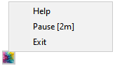

# Rust Screenshotter

A lightweight Windows system tray application that automatically takes periodic screenshots.



## Features

- Runs silently in the system tray
- Takes screenshots at configurable intervals
- Saves as JPEG with configurable quality
- Auto-skips when screen is locked or screensaver is active
- Auto-skips when user has been idle (no keyboard/mouse activity)
- Pause/resume via right-click menu
- Organizes screenshots into date-based subfolders

## Configuration

Edit `config.ini`:

```ini
[settings]
screenshot_save_dir = C:\Screenshots
jpeg_quality = 80
screenshot_interval_seconds = 60
skip_if_inactive_seconds = 180
enable_logging = 1
```

- `screenshot_save_dir` — Where to save screenshots
- `jpeg_quality` — JPEG quality 1-100 (higher = bigger files)
- `screenshot_interval_seconds` — Seconds between screenshots (default: 60)
- `skip_if_inactive_seconds` — Skip screenshot if no keyboard/mouse activity for this many seconds (default: 180)
- `enable_logging` — Set to `0` to disable logging

## Building

```bash
cargo build --release
```

